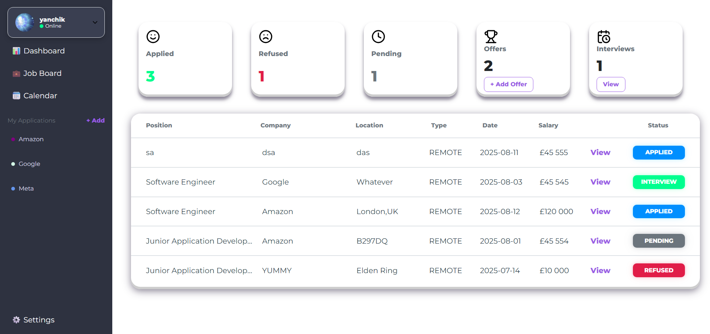
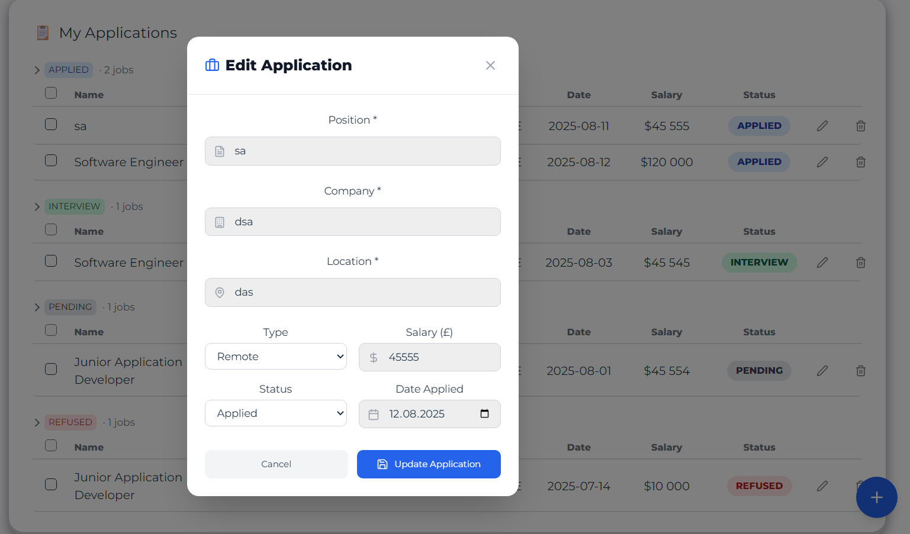
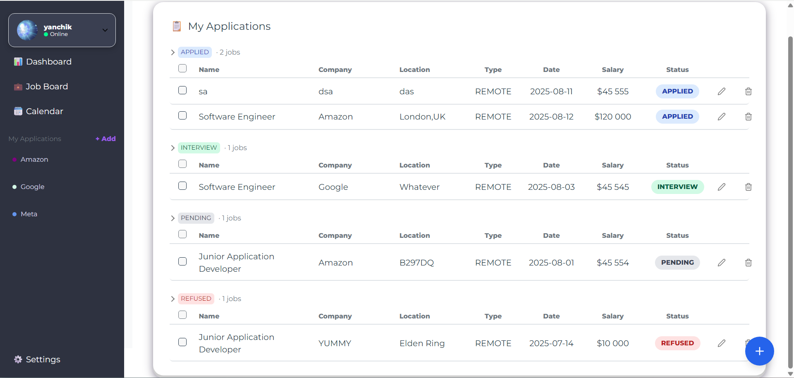
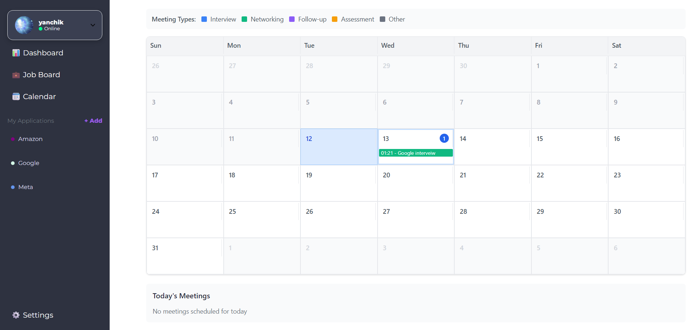

# Job Tracker App

A comprehensive web application to manage and track your job applications, interviews, and career progress. Features an intuitive dashboard and detailed data tables to help you stay organized throughout your job search journey.


## ✨ Features

- **📊 Interactive Dashboard:** Real-time overview of application status, success rates, and upcoming interviews
- **📝 Applications Management:** Track companies, positions, application dates, and current status
- **📅 Interview Scheduler:** Manage meetings, interviews, and networking events
- **📈 Progress Analytics:** Visual insights into your job search performance
- **🤖 AI-Powered Insights** *(Coming Soon)*: ML-driven predictions and personalized recommendations

## 🛠 Tech Stack

### Frontend
- **React 18+** with modern hooks and context
- **Vite** for fast development and building
- **JavaScript/TypeScript** for type safety
- **Axios** for HTTP requests and API communication
- **CSS3/SCSS** for responsive styling

### Backend
- **Django 4+** with REST framework
- **Python 3.8+** for backend logic
- **JWT Authentication** for secure user sessions
- **PostgreSQL/SQLite** for data storage
- **Django ORM** for database operations

### Future Integrations
- **Machine Learning:** scikit-learn, TensorFlow for predictive analytics
- **Notifications:** Email and browser push notifications

## 🚀 Getting Started

### Prerequisites

Ensure you have the following installed:
- [Node.js](https://nodejs.org/) (v16 or higher)
- [Python](https://python.org/) (v3.8 or higher)
- [Git](https://git-scm.com/)

> **Note:** This project uses Vite for the frontend build tool, which provides faster development and build times compared to traditional webpack setups.

### Installation

1. **Clone the repository**
   ```bash
   git clone https://github.com/yourusername/job-tracker-app.git
   cd job-tracker-app
   ```

2. **Backend Setup**
   ```bash
   cd backend
   
   # Create virtual environment
   python -m venv venv
   
   # Activate virtual environment
   # On Windows:
   venv\Scripts\activate
   # On macOS/Linux:
   source venv/bin/activate
   
   # Install dependencies
   pip install -r requirements.txt
   
   # Run migrations
   python manage.py makemigrations
   python manage.py migrate
   
   # Create superuser (optional)
   python manage.py createsuperuser
   
   # Start development server
   python manage.py runserver
   ```

3. **Frontend Setup**
   ```bash
   # Open new terminal and navigate to frontend
   cd frontend
   
   # Install dependencies
   npm install
   # or
   yarn install
   
   # Start Vite development server
   npm run dev
   # or
   yarn dev
   ```

### 🌐 Usage

1. Visit `http://localhost:5173/login` for the React frontend (Vite default port)
2. Access the Django admin at `http://localhost:8000/admin` (if superuser created)
3. Start adding your job applications and tracking your progress!

## 📁 Project Structure

```
job-tracker-app/
├── frontend/
│   ├── src/
│   │   ├── components/
│   │   ├── pages/
│   │   ├── context/
│   │   └── utils/
│   ├── public/
│   ├── vite.config.js
│   └── package.json
├── backend/
│   ├── backend/
│   ├── apps/
│   ├── requirements.txt
│   └── manage.py
├── docs/
│   └── screenshots/
└── README.md
```

## 📸 Screenshots

### Dashboard Overview
*Screenshot showing the main dashboard with application statistics and charts*


*Edit modal*

### Applications Table
*Screenshot displaying the job applications data table with filtering options*

### Interview Calendar
*Screenshot of the meetings/interviews scheduling interface*

### Phase 1 (Upcoming)
- [] ML-powered success prediction
- [] Email notifications
- [] Mobile-responsive design
- [] Advanced filtering and search
